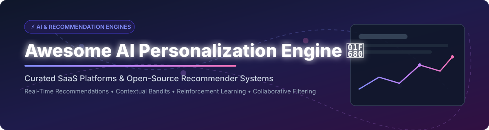

# 🚀 Awesome AI Personalization Engine

  

  
  
  
  
  

---

> **A curated list of production-grade SaaS platforms, open-source recommendation engines, reinforcement learning frameworks, and collaborative filtering libraries for real-time personalization.**

---

## 📌 Overview & Ecosystem Analysis

The **AI Personalization Engine & Recommender System** market is projected to grow from **~$11.5 Billion in 2024 to over $38 Billion by 2030** (CAGR ~22.5%). 

### 📊 Market Structure & Fragmentation
- **SaaS / Commercial Layer**: **Highly Fragmented to Moderately Concentrated**. Major cloud titans (**AWS Personalize**, **Microsoft Azure**) hold infrastructure dominance, while enterprise specialized vendors (**Dynamic Yield**, **Bloomreach**, **Insider**, **Algolia**) compete fiercely for omnichannel customer experience and CDP capabilities. It is **not a strict winner-take-all market** due to varied vertical requirements (e-commerce vs. streaming media vs. digital publishing).
- **Open-Source Engine Layer**: **Moderately Concentrated**. Production-grade universal engines like **Gorse** and foundational algorithm frameworks like **Implicit**, **LightFM**, **RecBole**, and **Recommenders** dominate developer adoption for self-hosted infrastructure.

---

## 📑 Table of Contents

- [☁️ SaaS / Hosted Platforms](#-saas--hosted-platforms)
- [🔓 Open-Source GitHub Projects](#-open-source-github-projects)
  - [🌐 Universal Recommender Systems](#-universal-recommender-systems)
  - [⚡ Collaborative Filtering & Matrix Factorization](#-collaborative-filtering--matrix-factorization)
  - [🧠 Deep Learning & Reinforcement Learning Frameworks](#-deep-learning--reinforcement-learning-frameworks)
  - [🎓 Specialized & Academic Recommenders](#-specialized--academic-recommenders)
- [⭐ Star History](#-star-history)
- [💖 Support & Sponsorship](#-support--sponsorship)
- [🤝 How to Contribute](#-how-to-contribute)
- [⚠️ Disclaimer](#%EF%B8%8F-disclaimer)

---

## ☁️ SaaS / Hosted Platforms

Below is a curated table of leading commercial AI personalization platforms, sorted in **descending order by company size** (market capitalization / enterprise valuation / revenue).

| Product Name | Company Size (Valuation / Revenue) | Description & Key Details | Pricing Tier Limits |
| :--- | :--- | :--- | :--- |
| **[Microsoft Personalizer AI](https://learn.microsoft.com/en-us/azure/ai-services/personalizer/)** 🤖 | **~$3.84 Trillion** (Microsoft Market Cap) | **Reinforcement learning-based personalization service (retiring October 1, 2026).** Uses contextual bandits to select the best action for each user context, learning from reward feedback . **Key APIs**: **Rank API** returns the best action ID for a given context; **Reward API** provides feedback (0-1 score) to improve decision-making . **Learning modes**: **Apprentice mode** (learns from existing decision logic to mitigate cold start) and **Online mode** (explores and exploits) . **Retirement notice**: New resources could not be created since September 20, 2023; service retires October 1, 2026. **Migration path**: Microsoft recommends the open-source **microsoft/learning-loop** . **Use cases**: E-commerce product selection, content recommendation, ad placement, notification timing . | Free tier available (F0 instance: up to 50k transactions/month free); paid tier based on per-1,000 transactions scale. |
| **[AWS Personalize](https://aws.amazon.com/personalize/)** ☁️ | **~$2.71 Trillion** (Amazon Market Cap) | **Fully managed ML service for real-time personalized recommendations.** Uses the same ML technology as Amazon.com with no ML expertise required . **Use cases**: Product recommendations, individualized search results, customized direct marketing, content carousels, ad placement . **Key features**: Real-time or batch recommendations; handles cold-start problems for new users and items; data encrypted and private; pay only for what you use . **Deployment**: API-based; integrates with websites, apps, SMS, and email . | Free Tier: 20 GB data storage/mo, 100 TPS hours of recommendation/mo, 20 training hours/mo for first 2 months; then pay-as-you-go based on ingestion, training, and recommendation requests. |
| **[Dynamic Yield](https://www.dynamicyield.com/)** 🎯 | **~$485 Billion** (Mastercard Market Cap) | **Enterprise personalization and experimentation platform (acquired by Mastercard).** **Experience APIs** enable server-side personalization without client-side flicker, protecting internal strategies and user privacy . **Key APIs**: **Choose API** (primary endpoint for activating campaigns and returning variations); **Pageview API** (reports pageviews without campaign); **Engagement API** (tracks clicks and impressions); **Search API** (AI-powered semantic and visual search); **Event Reporting API** (Login, Add to Cart, Purchase, Video Play) . **Shopify Checkout integration** renders campaign content as native checkout UI components with selector names and targeting rules . **Deployment**: API-based for performance-sensitive campaigns, script-based for quick time-to-value, or hybrid . | Custom enterprise annual contracts based on traffic volume and module scope; no standalone free tier. |
| **[Algolia Recommend](https://www.algolia.com/doc/libraries/sdk/methods/recommend/get-recommendations)** 🔍 | **~$2.3 Billion** (Valuation) | **AI-powered recommendations from the Algolia search platform.** **Related Products** model suggests items similar to the current product; **Frequently Bought Together** and **Trending Items** models available . **Threshold parameter** controls recommendation confidence. SDKs available for JavaScript, Python, Go, Java, C#, PHP, Kotlin, Swift, Dart . **Integration**: Works alongside Algolia Search for unified discovery and recommendation. | Build Tier (Free): 10,000 search/recommend requests & 10,000 records per month; Grow Tier: \$0.50/1k requests beyond free tier. |
| **[Bloomreach Engagement](https://www.bloomreach.com/)** 🌸 | **~$2.2 Billion** (Valuation / \$260M+ ARR) | **AI-powered customer data platform and omnichannel marketing suite.** **Recommendations**: Uses collaborative-based models (ALS, word2vec) and **sequence-based models (two-tower neural networks)** to handle consecutive interactions and alleviate cold-start via metadata . **Predictions**: Decision trees, random forests, and gradient-boosted trees for purchase probability, email open, optimal send time, churn, and in-session behavior . **Scenarios**: No-code drag-and-drop journey orchestration with multi-agentic AI (Loomi AI) for automated scenario creation . **Training data**: User events including views, clicks, cart interactions, and purchases . | Custom enterprise pricing tailored to data volume and monthly active contacts; custom demo/quote required, no public free tier. |
| **[Insider](https://insiderone.com/)** 🚀 | **~$2 Billion** (Valuation / \$150M ARR) | **AI-powered personalization and customer experience platform.** **Key capabilities**: Turn anonymous traffic into customers without login; AI models predict intent for tailored recommendations and promotions; real-time personalization adapts banners, collections, and messaging . **Proven results**: Adidas 259% increase in AOV; MAC 17.2X ROI; Slazenger 49X ROI in 8 weeks . **Recognition**: 2025 Gartner Peer Insights Customers' Choice for Multichannel Marketing Hubs (4.9/5 rating); G2 #1 Leader across 11 categories including Personalization Software and CDP . | Custom enterprise tiering based on website/app traffic and integration scope; private demo/quote required. |
| **[Coveo](https://www.coveo.com/)** 💡 | **~$350 Million** (Market Cap / \$151M Revenue) | **AI-powered relevance platform for customer and employee experiences (TSX: CVO).** **Relevance Generative AI**: Synthesizes answers from unified content sources (Salesforce knowledge, community posts, PDFs, LMS modules, video transcripts) with citations . **Case Assist AI**: Classifies issues as users type, suggests categories, and generates answers to deflect cases . **Agent integration**: Rich context in CRM showing self-service journey before escalation . **Analytics**: Continuous learning from every search, click, and generated answer; knowledge gap detection and FAQ drafting . | Enterprise quote-based pricing depending on connected content sources and user query volumes; trial available upon request. |
| **[Monetate](https://monetate.com/)** 🛍️ | **~$50 Million** (Historical Valuation / \$12M ARR) | **Enterprise experience optimization platform.** **Agentic AI**: Real-time adaptive intelligence that continuously learns, acts, and improves outcomes across personalization, recommendations, and experimentation . **Symphony & Maestro**: Symphony orchestrates AI, data, and decisioning into harmonized 1:1 experiences; Maestro delivers enterprise-grade experimentation without flicker . **Omnichannel**: Web, mobile, email, in-store, and customer care . **Developer-friendly**: Open APIs, SDKs, and CI/CD alignment . **Compliance**: HIPAA-ready, GDPR, CCPA, PCI-compliant . | Custom annual subscription based on overall site impressions and enterprise features; custom quote required. |
| **[Kibo Personalization](https://docs.kibocommerce.com/)** 🏬 | **Private Equity Backed** (\$56M Total Funding) | **Personalization and search platform for commerce.** **Product Suggest Settings** includes `personalizationExperience` parameter for configuring personalized product suggestions . **Search API** delivers personalized product discovery. | Custom quote-based pricing for composable commerce modules; no public free tier. |
| **[Crossing Minds](https://www.mitacs.ca/our-projects/automatic-machine-learning-for-recommender-systems/)** 🧠 | **Private / Early Stage** (~\$3.9M Est. Revenue) | **ML-based recommendation systems with auto-machine learning research.** Companies integrate their data and obtain on-demand personalized recommendations . **Research focus**: Auto-ML for recommender systems to reduce customer onboarding turnaround time and improve scalability . | Custom pricing based on monthly recommendation API volume; free developer trial available upon request. |

---

## 🔓 Open-Source GitHub Projects

Sorted in **descending order by GitHub Stars_Count**. Each repository badge links directly to its official stargazers page.

### 🌐 Universal Recommender Systems

- **[Recommenders](https://github.com/recommenders-team/recommenders)**   
  🛠️ **Linux Foundation project (originally Microsoft Recommenders).** **MIT licensed**, Python-based. Best-practice algorithms and utilities for building, testing, and deploying recommender systems (ALS, SVD, VAE, Two-Tower, LightGCN, FastAI). Includes GPU acceleration, Azure ML integration, and benchmark datasets.

- **[Gorse](https://github.com/gorse-io/gorse)**   
  🚀 **The leading open-source recommender system engine.** **Apache-2.0 licensed**, written in Go. **Multi-source** recommendations (collaborative filtering, item-to-item, user-to-user, latest, trending), **LLM integration**, GUI dashboard, RESTful APIs, and distributed worker nodes for high-throughput online serving.

- **[RecBole](https://github.com/RUCAIBox/RecBole)**   
  📊 **Unified, comprehensive recommendation framework based on PyTorch.** **MIT licensed**. Includes 80+ recommendation algorithms covering general, sequential, context-aware, and knowledge-based recommendation models with standard benchmark evaluation datasets.

### ⚡ Collaborative Filtering & Matrix Factorization

- **[Implicit](https://github.com/benfred/implicit)**   
  ⚡ **Fast collaborative filtering for implicit feedback datasets.** **MIT licensed**, C++/Python-based. High-performance multi-threaded implementation of Alternating Least Squares (ALS), Bayesian Personalized Ranking (BPR), Logistic Matrix Factorization, and GPU acceleration via CUDA.

- **[LightFM](https://github.com/lyst/lightfm)**   
  💡 **Hybrid matrix factorization for implicit and explicit feedback.** **Apache-2.0 licensed**, Python/Cython-based. Incorporates both user and item metadata into matrix factorization representations with BPR and WARP ranking loss functions.

- **[Surprise](https://github.com/NicolasHug/Surprise)**   
  🎁 **Python scikit for building and analyzing explicit recommendation systems.** **BSD-3-Clause licensed**. Provides explicit rating algorithms (SVD, SVD++, NMF, Slope ONE, k-NN) with built-in cross-validation and evaluation metrics.

- **[TensorRec](https://github.com/gorse-io/tensorrec)**   
  🧪 **TensorFlow-based recommendation framework.** **Apache-2.0 licensed**. Allows customization of user/item feature representations and loss functions for contextual recommendations.

### 🧠 Deep Learning & Reinforcement Learning Frameworks

- **[DeepRecommender](https://github.com/NVIDIA/DeepRecommender)**   
  🏎️ **NVIDIA GPU-accelerated deep autoencoders for collaborative filtering.** **Apache-2.0 licensed**, PyTorch-based. Optimized for high-throughput training on large-scale rating matrices.

- **[microsoft/learning-loop](https://github.com/microsoft/learning-loop)**   
  🔄 **Open-source contextual bandits and reinforcement learning framework.** **MIT licensed**. Recommended migration target for Microsoft Personalizer AI users.

### 🎓 Specialized & Academic Recommenders

- **[Mr. DLib](https://github.com/mr-dlib/mr-dlib)**   
  🎓 **Recommendations-as-a-service for academic digital libraries.** Open-source initiative by Trinity College Dublin and University of Konstanz providing article recommendation APIs.

---

## ⭐ Star History

---

## 💖 Support & Sponsorship

If you find this curated list helpful for your research, team, or production architecture, please consider supporting the project! ⭐

- 🌟 **Star the Repository**: Helps increase visibility and discovery for the community.
- 🔀 **Fork & Share**: Spread the word on LinkedIn, Twitter/X, and developer forums.
- ☕ **Buy Me a Coffee / Sponsor**: Support ongoing maintenance and research updates via [GitHub Sponsors](https://github.com/sponsors/ishandutta2007).

---

## 🤝 How to Contribute

Contributions are warmly welcome! Please follow these simple steps:

1. **Fork** the repository.
2. **Add/Edit** entries in `README.md` following the established table / list format.
3. Provide factual descriptions, licensing details, and official links.
4. Submit a **Pull Request** with a concise summary of your additions.

Please review our awesome list collection at [Awesome-Awesome-Awesome](https://github.com/ishandutta2007/Awesome-Awesome-Awesome).

---

## ⚠️ Disclaimer

- This is a **community-curated** open-source list for informational purposes only — not an official endorsement.
- Ensure strict compliance with GDPR, CCPA, and applicable user data protection regulations when handling behavior and preference streams.

---

  <b>Made with ❤️ for Data Scientists, ML Engineers, Product Managers, and Personalization Teams.</b>

